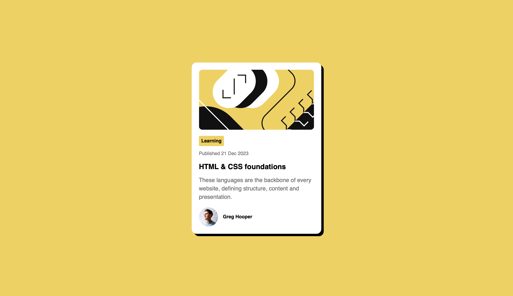

# Blog_preview_card
# Frontend Mentor - Blog preview card solution

This is a solution to the [Blog preview card challenge on Frontend Mentor](https://frontendmentor.io/). Frontend Mentor challenges help you improve your coding skills by building realistic projects.

# Table of contents

* [Overview](#overview)
* [The challenge](#the-challenge)
* [Screenshot](#screenshot)
* [Links](#links)
* [My process](#my-process)
* [Built with](#built-with)
* [What I learned](#what-i-learned)
* [Continued development](#continued-development)
* [Author](#author)

# Overview
The challenge
Users should be able to:

* View the optimal layout for the card component depending on their device's screen size
* See hover states for all interactive elements on the page

## Screenshot

 

## Links

* Solution URL: [GitHub Repo](https://github.com/Agalya141/Blog_Preview_Card)
* Live Site URL: [Live Demo](https://agalya141.github.io/Blog_Preview_Card/)

## My process
Built with

* Semantic HTML5 markup
* CSS Custom Properties (Variables)
* Flexbox layout model
* Mobile-first/Responsive workflow
* Google Fonts integration (Figtree)

## What I learned
During this project, I strengthened my understanding of the CSS box model and how small syntax details affect rendering. Specifically, I practiced:

1. Viewport Meta Syntax: Catching a subtle bug where `initial-scale:0.1` used a colon instead of `=`, which caused the page to render zoomed out on mobile devices.
2. Box Model Debugging: Learning that padding can be "working" correctly but invisible if the element has no background or border — solved by temporarily adding `border: 1px solid red` to reveal the box during debugging.
3. Flat/Retro Box Shadows: Recreating a hard-edged shadow (instead of a soft blurred one) by setting the blur radius to `0`.

```css
/* Example of the hard shadow I implemented */
.card {
  box-shadow: 8px 8px 0 0 var(--black);
}
```

4. Global Resets: Realizing that resetting `padding` alone in the `*` selector isn't enough — default browser `margin` on elements like `<p>` and `<h1>` still needs to be reset separately to avoid unexpected spacing.

Continued development
In future projects, I want to focus on:

* Getting faster at spotting margin vs. padding issues without needing debug borders.
* Comparing mobile and desktop design files more carefully before writing CSS, to catch fixed-width vs. fluid layout decisions early.

## Author

* GitHub - [@Agalya141](https://github.com/Agalya141)
* Frontend Mentor - [@Agalya141](https://www.frontendmentor.io/profile/Agalya141)
* LinkedIn - [Agalya M](https://www.linkedin.com/in/agalya6)